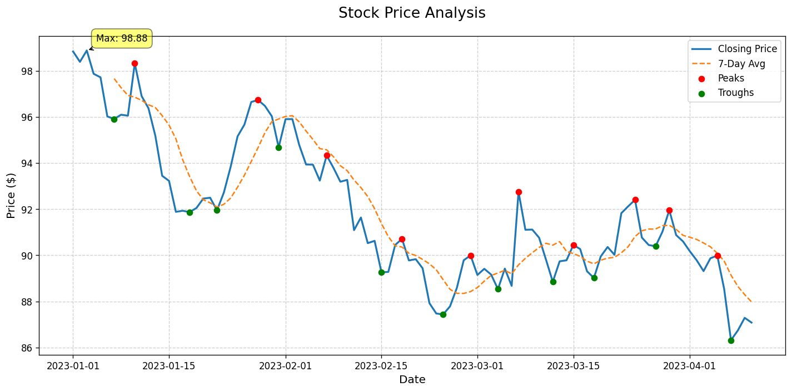

# 📊 StockScope - Stock Price Analysis Dashboard



**StockScope** is an advanced Python-powered financial visualization tool that transforms raw stock data into actionable insights through professional-grade technical analysis charts.

## 🌟 Key Features

- **Multi-Layered Visualization**:
  - Historical price trends (Line Chart)
  - 7/30-day moving averages
  - Automatic peak/trough detection
- **Smart Annotations**:
  - Highlights key support/resistance levels
  - Marks highest/lowest closing prices
- **Data Flexibility**:
  - Works with CSV exports (Yahoo Finance, Bloomberg)
  - Built-in sample data generator
  - Optional real-time data via yFinance API
- **Professional Outputs**:
  - Publication-ready PNG exports
  - Customizable styling
  - Responsive layout for presentations

## 🚀 Quick Start

### Prerequisites
- Python 3.8+
- Pip package manager

### Installation
```bash
git clone https://github.com/Kirankumarvel/StockScope-Stock-Price-Analysis-Dashboard.git
cd StockScope
pip install -r requirements.txt
```

### Basic Usage
1. Add your stock data to `data/stock_data.csv` (Date, Close columns)
2. Run analysis:
   ```bash
   python stock_analysis.py
   ```
3. View `assets/stock_analysis.png`

## 📂 Data Integration

### Supported Formats
```csv
Date,Close,Volume
2023-01-01,150.20,4500000
2023-01-02,152.50,5200000
```

### Live Data Option (using yFinance)
```python
# Uncomment in stock_analysis.py:
# import yfinance as yf
# df = yf.download('AAPL', period='1y').reset_index()
```

## 🛠️ Customization Guide

### Technical Adjustments
- Change moving average window:
  ```python
  df['Rolling_30D'] = df['Close'].rolling(30).mean()  # 30-day MA
  ```
- Modify detection sensitivity:
  ```python
  df['Peak'] = df['Close'] == df['Close'].rolling(10, center=True).max()  # 10-day window
  ```

### Visual Styling
```python
plt.style.use('seaborn')  # Alternative: 'ggplot', 'fivethirtyeight'
colors = {
    'price_line': '#2c3e50',
    'moving_avg': '#e74c3c', 
    'peaks': '#27ae60',
    'troughs': '#3498db'
}
```

## 📈 Sample Use Cases

1. **Technical Analysis**:
   - Identify resistance/support levels
   - Spot trend reversals
   - Compare short vs long-term averages

2. **Portfolio Reporting**:
   - Generate visual performance summaries
   - Highlight key trading days
   - Create presentation-ready charts

## 🐛 Troubleshooting

| Issue | Solution |
|-------|----------|
| Missing data file | Ensure CSV is in `data/` folder or let script generate sample data |
| Date format errors | Use YYYY-MM-DD format in CSV |
| Flat line chart | Check for duplicate/missing values in data |
| Module errors | Run `pip install -r requirements.txt` |

## 🤝 Contributing

We welcome:
- New technical indicators (RSI, Bollinger Bands)
- Interactive features
- Additional data source integrations
- Improved visualization styles

**Contribution Guide**:
1. Fork the repository
2. Create a feature branch
3. Submit a pull request

## 📜 License

MIT License - Free for personal and commercial use

---

**Pro Tip**: For institutional-grade analysis, combine with:
- [TA-Lib](https://github.com/mrjbq7/ta-lib) for advanced indicators
- [Backtrader](https://www.backtrader.com/) for strategy testing
- [Streamlit](https://streamlit.io/) for web deployment

